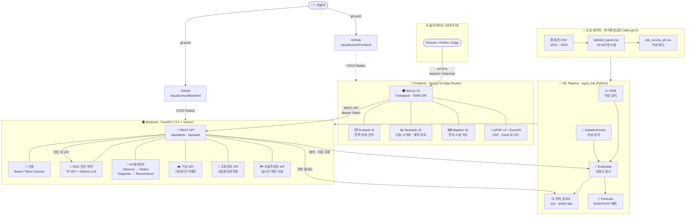

<div align="center">


<br/>

<p>
  
  
  
</p>

</div>

<br/>

## 🌊 About AquaSumun

> **AquaSumun**은 공공하수처리시설의 수질 데이터를 AI로 분석하는 관제 플랫폼입니다.  
> 한국환경공단 공공데이터(data.go.kr) 기반으로 **15,022개 시설**의 이상 감지·예측·자동 진단을 지원합니다.

**2026 AX 아이디어 경진대회** — 데이터 활용 제품·서비스(앱/AI Agent) 개발 본선 진출작

<br/>

## 🎯 핵심 기능

| 기능 | 설명 |
| :--- | :--- |
| 🤖 **AI 에이전트** | Observe → Detect → Diagnose → Recommend 자율 진단 루프 |
| 📈 **수질 예측** | BOD/TN/TP 48시간 AI 예측 + 신뢰 구간 시각화 |
| 🔍 **XAI 설명** | SHAP 피처 기여도로 예측 근거 투명하게 제공 |
| 🚨 **이상 감지** | HGB + IsolationForest 앙상블 위험도 실시간 모니터링 |
| 🌧️ **강수·유입부하 분석** | 기상청 API 연동 강수 예보 + 강수 → BOD/TN/TP 유입부하량 산출 |
| 🌿 **조류경보 모니터링** | 국립환경과학원 조류경보제 실시간 측정결과 연동 |
| 🏞️ **하천 수질 현황** | 수질측정망 실시간 API — 상류 하천 수질 컨텍스트 제공 |
| 🗺️ **전국 시설 지도** | Mapbox 기반 시설 위치·위험도·강수 레이어 시각화 |
| 💬 **AI 챗 진단** | RAG + Ollama LLM 기반 시설별 자연어 Q&A |
| 📄 **보고서 자동생성** | 자가측정·일일보고·ESG 보고서 PDF/Excel 자동 생성 |
| 🔔 **알림 전송** | 경보 발생 시 담당자 즉시 통보 (SMS 연동) |

<br/>

## 🧪 기술 스택

#### Frontend
<p>
  
  
  
  
  
  
  
  
</p>

#### Backend & AI / ML
<p>
  
  
  
  
  
  
</p>

#### Export & Tools
<p>
  
  
  
  
</p>

<br/>

## 🚀 실행 방법

#### 사전 요건
- Node.js 20+
- 백엔드 서버 실행 중 (`http://localhost:8000`) → [aquasumun-backend](../aquasumun-backend)

```bash
# 의존성 설치
npm install

# 개발 서버 시작
npm run dev
# → http://localhost:3000
```

#### 환경변수 (`.env.local`)

```env
NEXT_PUBLIC_API_URL=http://localhost:8000
NEXT_PUBLIC_USE_MOCK=false
```

> `NEXT_PUBLIC_USE_MOCK=true` 로 변경하면 목업 데이터로 백엔드 없이 실행 가능합니다.

<br/>

## 🔑 데모 계정

```yaml
email   : demo@example.com
password: demo123
```

<br/>

## 📂 프로젝트 구조

```bash
src/
├── app/                        # Next.js App Router 페이지
│   ├── login/                  # 로그인
│   ├── map/                    # 전국 시설 지도
│   ├── mypage/                 # 마이페이지
│   └── plants/
│       ├── page.tsx            # 시설 목록
│       └── [id]/               # 시설별 상세
│           ├── dashboard/      # 대시보드 (수질 지표·예측·진단)
│           ├── forecast/       # AI 예측 + SHAP 설명
│           ├── reports/        # 보고서 생성
│           ├── alerts/         # 경보 타임라인
│           ├── chat/           # AI 챗 진단
│           └── notifications/  # 알림 내역
├── features/                   # 기능별 UI 컴포넌트
│   ├── auth/                   # LoginPage · MyPage
│   ├── dashboard/              # DashboardPage · ForecastChart · DiagnosisCard
│   │                           # AgentRunModal · RainfallImpactPanel · WeatherContextPanel
│   ├── forecast/               # ForecastPage · TimeSeriesChart · ShapChart
│   ├── map/                    # MapPage · PlantMap (Mapbox)
│   ├── alerts/                 # AlertsPage · AlertTimeline
│   ├── chat/                   # ChatPage (RAG + LLM)
│   ├── notifications/          # NotificationsPage
│   ├── plants/                 # PlantsListPage · PlantCard
│   └── reports/                # ReportsPage · ReportPreview
├── components/
│   ├── common/                 # Button · Badge · Card · Modal · Skeleton · AquaLogo
│   └── layout/                 # Header · Sidebar
├── api/                        # 백엔드 API 호출 레이어 (index.ts · mock.ts)
├── hooks/                      # useAuth · usePlant · useStream
├── store/                      # Zustand 전역 상태
├── types/                      # TypeScript 인터페이스
├── constants/                  # 방류 기준 등 상수
└── utils/                      # 공통 유틸 · reportPdf
```

<br/>

## 🏗️ 시스템 아키텍처



<br/>

## 🔭 TMS 연동 확장 로드맵

> 현재 버전은 한국환경공단 **공개 공공데이터(연간 통계 CSV)** 기반 PoC입니다.  
> 아래 로드맵을 통해 **실시간 TMS 센서 데이터** 연동으로 확장 가능합니다.

| 단계 | 내용 | 비고 |
| :---: | :--- | :--- |
| **Phase 1 (현재)** | 한국환경공단 공공데이터(2015–2024) 기반 학습·예측 + 기상/조류/하천 API 연동 | PoC 완료 |
| **Phase 2** | 환경부/환경공단 수질TMS API 협약 체결 | 기관 협약 필요 |
| **Phase 3** | TMS 실시간 측정값(15분 간격) 수신 → 자동 재학습 파이프라인 구축 | 인프라 확장 |
| **Phase 4** | 실측 이상 발생 시 AI 에이전트 자동 경보 → 담당자 즉시 통보 | 현장 적용 |

```
현재 데이터 흐름:
  공공데이터 CSV (연간) → ML 학습 → 예측 API → 대시보드
  기상청 / 국립환경과학원 / 수질측정망 API → 실시간 컨텍스트

TMS 연동 후:
  TMS 센서 (15분 간격) → 스트리밍 수신 → 실시간 이상 감지 → 자동 경보
```

<br/>

## 🤝 개발 방식

```yaml
architecture:
  frontend : "Next.js 16 App Router + Zustand v5"
  backend  : "FastAPI 0.3.0 REST API (Bearer token)"
  ml       : "HGB + IsolationForest Ensemble"
  rag      : "TF-IDF + Ollama LLM (RAG)"
  map      : "Mapbox GL + react-map-gl"

data:
  source   : "한국환경공단 공공하수처리시설 현황 (2015–2024)"
  size     : "15,022개 시설 · 연도별 수질 및 처리 효율"
  forecast : "5,683개 시설 AI 예측 가능 (2년 이상 데이터)"
  external : "기상청 단기예보 · 국립환경과학원 조류경보 · 수질측정망 실시간 API"

roadmap:
  phase2   : "수질TMS 실시간 API 연동 (환경부 협약)"
  phase3   : "15분 간격 센서 데이터 자동 재학습 파이프라인"
  phase4   : "현장 AI 에이전트 자동 경보 시스템"
```

<br/>

## 📬 Contact

<p>
  <a href="mailto:wjdwoals000619@gmail.com">
    
  </a>
  <a href="https://github.com/AquaSumun">
    
  </a>
</p>

<br/>

<div align="center">

---

<sub>Made with 🌊 by <strong>AquaSumun</strong> · AI for a cleaner water future.</sub>


</div>
